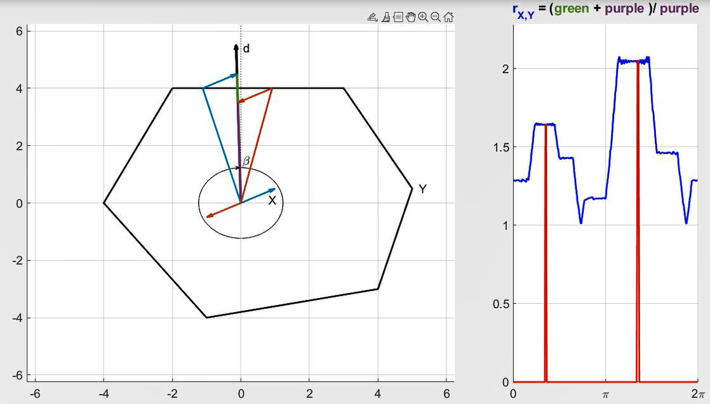

# The Maximax Minimax Quotient Theorem

This repository contains the MATALB codes used in my paper "[The Maximax Minimax Quotient Theorem](https://link.springer.com/article/10.1007/s10957-022-02008-z)" also available on [ArXiv](https://arxiv.org/abs/2104.15025). This paper establishes the following optimization theorem on polytopes.

**Theorem:**
If $\mathcal{X}$ and $\mathcal{Y}$ are two polytopes in $\mathbb{R}^n$ with $-\mathcal{X} \subseteq interior(\mathcal{Y})$, $\dim \mathcal{X} = 1$, and $\dim \mathcal{Y} = n$, then 
$$\underset{d\\, \in\\, \mathbb{S}}{\max}\ r_{\mathcal{X}, \mathcal{Y}}(d) = \max \big\\{ r_{\mathcal{X}, \mathcal{Y}}(x_1), r_{\mathcal{X}, \mathcal{Y}}(x_2) \big\\},$$
where $\partial \mathcal{X} = \\{x_1, x_2\\}$ and
$$r_{\mathcal{X}, \mathcal{Y}}(d) := \frac{\underset{x\\, \in\\, \mathcal{X},\\ y\\, \in\\, \mathcal{Y}}{\max} \big\\{ \\|x + y\\| : x + y \in \mathbb{R}^+d \big\\} }{ \underset{x\\, \in\\, \mathcal{X}}{\min} \big\\{ \underset{y\\, \in\\, \mathcal{Y}}{\max} \big\\{ \\|x + y\\| : x + y \in \mathbb{R}^+d \big\\} \big\\} }, \qquad \text{for all} \quad d \in \mathbb{S} := \big\\{z \in \mathbb{R}^n : \\|z\\| = 1 \big\\}.$$

The proof of this theorem is entirely geometrical and is nicely illustrated by the picture below.
For a given direction $d$ the numerator of $r_{\mathcal{X}, \mathcal{Y}}(d)$ represents the length of the 🟩green and 🟪purple segment, while its denominator represents the length of the 🟪purple segment. 



Then, as we rotate direction $d$ we can observe how this ratio of lengths is varying and find the maximum of $r_{\mathcal{X}, \mathcal{Y}}(d)$.
Using the codes available in this repository we can generate an illustrative video of this process, as posted on [YouTube](https://www.youtube.com/watch?v=rjKzHyDJX40).


<p align="center">  </p>


## File Structure
- The code `Maximax_minimax_video.m` generates a video illustrating the principle of the proof of the Theorem. 
- The function `circular_arrow.m` is taken from [MathWorks file exchange](https://www.mathworks.com/matlabcentral/fileexchange/59917-circular_arrow).


## Citation
```
@article{bouvier2022maximax,  
  title = {The Maximax Minimax Quotient Theorem},   
  author = {Jean-Baptiste Bouvier and Melkior Ornik},      
  journal = {Journal of Optimization Theory and Applications},
  year = {2022},
  volume = {192},
  pages = {1084 -- 1101},
  publisher = {Springer},
  doi = {10.1007/s10957-022-02008-z}
}
```


## Contributors
- [Jean-Baptiste Bouvier](https://jean-baptistebouvier.github.io/)
- [Melkior Ornik](https://mornik.web.illinois.edu/)
